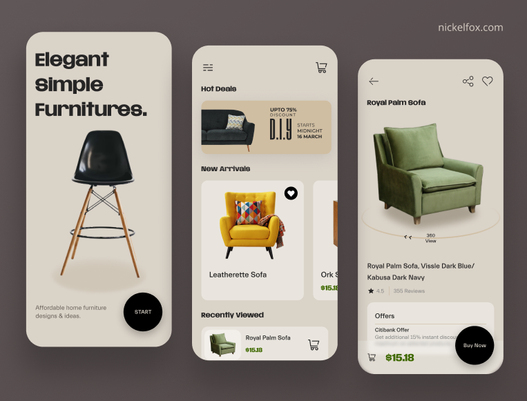

# furniture
 
 This Flutter repository is dedicated to a furniture app user interface (UI) design and implementation. It aims to provide a visually appealing and functional UI for a mobile application focused on furniture shopping and exploration.
## Getting Started

This project is a starting point for a Flutter application.

 
